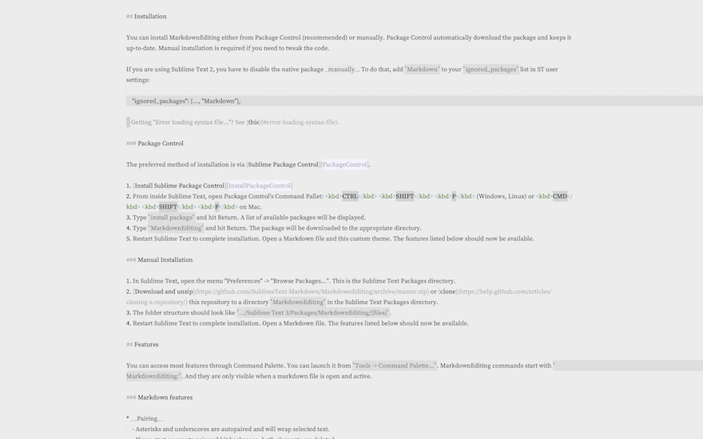

# higherContrastMarkdownEditingTheme 

This is a miniscule, trivial, fork of the basic (light) theme in the Sublime Text 3 [MarkdownEditing](https://github.com/mdesantis/MarkdownEditing) package.  I like the package, but I wanted a light theme with higher contrast---I find the grey-on-grey tiring for my eyes. So I literally just copied the theme file from that package (under a MIT license, so I guess this is too) and changed the foreground and background colors with a search-and-replace.  Not rocket science.  Slightly WIP/I expect to be tweaking this a little bit more to make things even more readable.

## Screenshots 

(All of the same chunk of text from the MarkdownEditing readme, using `"font_size": 16, "font_face": "Source Serif Pro"`, on my MBP16)

Original: 

Modified: 

## Installing 

1. Copy the tmTheme file into your `~/Library/Application\ Support/Sublime\ Text\ 3/Packages/User/`  directory. 

2.  Edit the appropriate configuration file for whichever flavor of markdown you're using to add the line `"color_scheme": "Packages/User/MarkdownEditorHighContrast.tmTheme"`